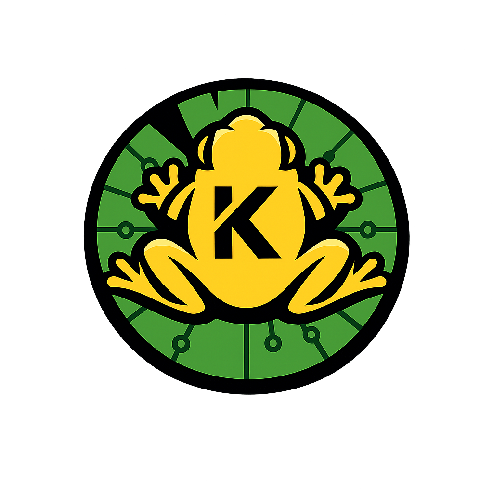

  

# Enciclopédia Kaa (v5.0.1)
>
> **Simples. Tipada. Poderosa. C-Bound JIT.**
>
> O significado de Kaa vem da língua indígena brasileira Nheegatu e significa: folha, árvore, bosque, flora ou in natura. A ideia da linguagem trata-se de compartilhar seus módulos de forma similar a uma floresta, onde as folhas das árvores caem quando já não tem mais utilidade, retornando matéria orgânica ao solo para que novas folhas possam crescer.

---

## 📖 Índice de Guias Oficiais

Para manter a organização e escalabilidade da documentação, os assuntos da linguagem foram descentralizados. Clique em um dos tópicos abaixo para explorar detalhadamente cada elemento da Kaa ou vá direto para a **[Página de Download](download.md)**:

1. **[Tipagem e Variáveis](guias/tipos_e_variaveis.md)**
   Entenda as flags (`-i`, `-s`, `-obj`, etc.), coerção dinâmica instintiva e controle estrito de tipos.

2. **[Sintaxe e Condicionais](guias/sintaxe_e_condicionais.md)**
   Conheça os loops, condicionais, operadores de alta performance como o `in` e a regra de ouro: *Strict Scope*.

3. **[Coleções e Memória](guias/colecoes_e_memoria.md)**
   Aprenda a utilizar Listas, Tuplas e Dicionários em conjunto com coletores atômicos `.rm_nil` e limpadores `.f_valuation`.

4. **[Orientação a Objetos (S-Bots)](guias/poo_e_sbots.md)**
   Aproxime-se da POO de forma livre e ágil usando *Factory Patterns*, os famosos *S-Bots* da Kaa, e veja como o despachante de propriedades eleva a velocidade do C-Bound.

5. **[Performance, JIT e Arenas](guias/performance_e_jit.md)**
   Mergulhe nas entranhas da máquina virtual em Cython! Entenda o *Peephole JIT*, a interoperabilidade com Python (`add -py`), Arenas, e confira o Benchmark Oficial.

6. **[Origens e Curiosidades (Por trás da Kaa)](guias/origem_e_curiosidades.md)**
   Saiba como a Kaa nasceu! Uma página focada na história da linguagem, motivação do autor (Saulo Ferro Maciel), influências (Crafting Interpreters), postagens no TabNews, Diolinux e outras anedotas da comunidade.

---

## 📜 Histórico de Versões

A linguagem Kaa está em constante evolução. Para fins de consulta, manutenção de sistemas antigos e preservação da história do projeto, todas as documentações anteriores estão catalogadas abaixo, conforme as diretrizes do nosso `rules.md`:

- **[Versão 4.8](v4.8/index.md)**
- **[Versão 4.7](v4.7/index.md)**
- **[Versão 4.6 (Formato Monolítico Antigo)](v4.6_monolithic/Enciclopedia_Kaa_Antiga.md)**
- **[Versão 4.5](v4.5/docs/Enciclopedia_Kaa_v4.5.md)**
